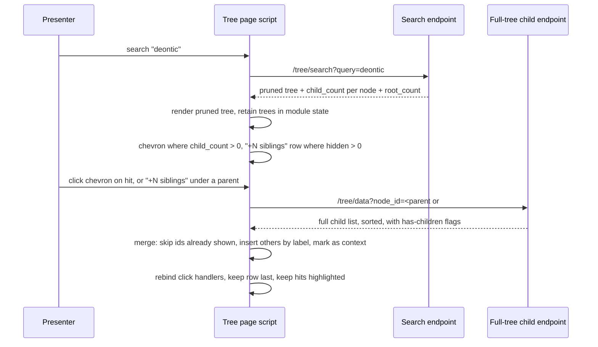
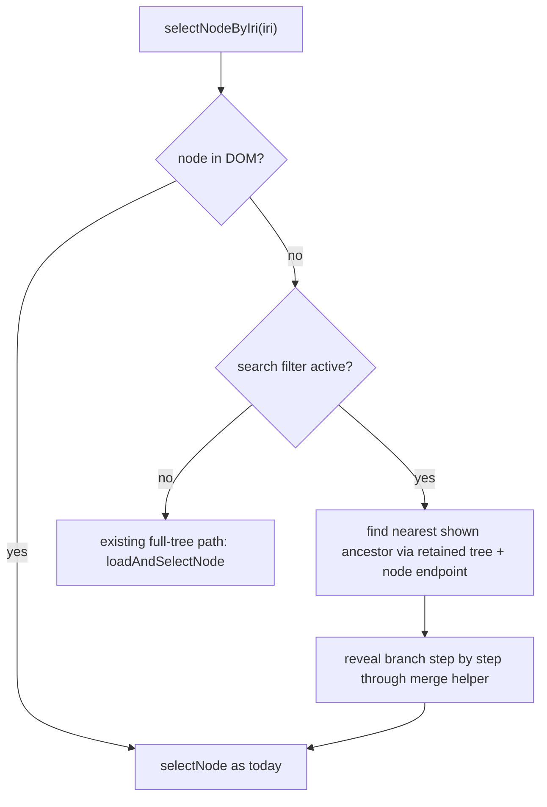

# Search Results Navigable Tree - Plan

## Goal Capsule

- **Objective:** A person who searches the FOLIO Ontology Explorer tree can keep browsing from any hit, down into its children and out to its siblings, without clearing the search or losing the other hits.
- **Means:** The search response carries full child counts, and the page merges lazily fetched children and siblings into the pruned tree instead of rebuilding it (KTD1, KTD2, KTD3).
- **Product authority:** This plan. Product decisions were settled in dialogue with the repository owner on 2026-09-19; the visual probe that settled the sibling control is disposable and not authoritative.
- **Execution profile:** Standard depth, one feature branch, six implementation units in dependency order. Backend first, then the shared merge helper, then the three behaviours that use it.
- **Stop conditions:** Stop and ask if the full child count cannot be computed cheaply for properties, or if merging into the pruned tree proves incompatible with the existing lazy loader in a way that would require rewriting the full-tree path.
- **Who finishes:** Codex workers implement each unit; the orchestrator verifies with `pytest` and a browser smoke pass, then ships through the normal PR flow.
- **Open blockers:** None.

---

## Product Contract

**Product Contract preservation:** changed: R15 and AE11 added for the failure path the flow analysis found unspecified; the three Outstanding Questions are resolved in KTD1, KTD6, and KTD7 and the section is removed; AE1 and AE3 example counts corrected to the live ontology's values; the second Success Criterion reworded to acknowledge the chevrons and rows R1 and R4 add. All other R, F, and AE IDs and their meaning are unchanged.

### Summary

Search results on the explorer tree page become a tree you can navigate rather than a static list. A hit that has children gets a chevron and expands in place, loading children on demand. Each branch whose children the search pruned gets a "+N siblings" row that reveals them, styled as context rather than as hits. Search state, highlighting, and every other hit stay exactly where they were. Nouns (classes) and verbs (properties) behave identically.

### Problem Frame

Search on the explorer tree renders a pruned tree: only the matches and the ancestors above them. That is a calm view and it demos well, but it is a dead end. A match renders as a leaf even when it has dozens of children, and everything beside it on its branch is gone.

The moment of pain is a live demo. The presenter searches for a concept, the audience sees it in context, and the next question is always "what is under that?" or "what else sits next to it?". Today the only route is to clear the search and drill down the full tree by hand to the same node. That costs time, loses the place, drops the other matches off screen, and reads as friction to the people watching. The right-hand details panel does list Parents and Children, but clicking one of those links while a search is active half-rebuilds the branch with unfiltered nodes while the "N matches" header stays up, which is worse than leaving search mode cleanly.

Parents are not part of the gap. The pruned tree already shows the full ancestor chain above every hit, and the owner confirmed that covers the "parents" need.

### Key Decisions

- **Ancestor chain stands in for a parents control** (session-settled: user-directed — chosen over a "show parent" action or a details-panel-first approach: the pruned tree already renders every hit under its full ancestor path). No governed R; this decision removes a requirement rather than adding one.
- **Children expand in place on the hit, loaded lazily** (session-settled: user-approved — chosen over reading children in the details panel or clearing the search to drill the full tree: keeps the presenter's place and the other hits on screen). Governs R1, R2, R3.
- **Siblings reveal through a "+N siblings" row at the end of each pruned branch** (session-settled: user-directed — chosen over a "1 of 12" pill on the ancestor row and over a siblings button on the hit itself: the count is visible before clicking, and the row also covers siblings of ancestors, which a hit-level control cannot). Governs R4, R5, R6.
- **Revealed nodes look like context, not hits.** Children and siblings brought in after the search are visually muted and never highlighted, so the hits keep the eye. Governs R7.
- **The details panel's Parent and Children links honour search mode.** Following one of those links while a search is active selects the node inside the pruned tree, revealing its branch the same way the tree controls would, instead of rebuilding the branch from the full tree. Governs R9.
- **Verbs get the same behaviour as nouns.** Both trees share one search experience; this is a coverage requirement, not a second feature. Governs R10.

### Requirements

**Expanding a hit's children**

- R1. A search hit that has children in the full ontology shows an expand chevron, even when none of those children matched the search.
- R2. Activating that chevron loads the hit's children on demand and shows them beneath the hit, inside the search results, without reloading or clearing the search.
- R3. A revealed child that itself has children gets the same chevron, so a presenter can keep drilling from a hit as deep as the ontology goes.

**Revealing pruned siblings**

- R4. Every branch in the search results whose children were pruned ends with a row reading "+N siblings", where N is the number of children the search hid on that branch.
- R5. Activating the row reveals those hidden siblings in place, loaded on demand, with the row changing to a control that hides them again.
- R6. The row appears at every ancestor level that had pruned children, including the top level, so a presenter can also answer "what else sits under this top-level branch".

**Keeping search context intact**

- R7. Children and siblings revealed after a search render as muted context: no match highlighting, no query highlighting, and clearly secondary to the hits, while remaining selectable.
- R8. Expanding children or revealing siblings never changes the match count, the highlighted hits, the visibility of the other hits, or the page URL.
- R9. Following a Parent or Child link in the details panel while a search is active selects that node inside the search results, revealing its branch as R2 or R5 would, and never rebuilds a branch from the full tree while search mode is on.
- R10. Every behaviour in R1 through R9 applies equally to the nouns (classes) tree and the verbs (properties) tree.
- R11. Selecting any revealed node updates the details panel and the URL exactly as selecting a node in the full tree does today.
- R12. Running a new search, clearing the search, or pressing Escape discards every revealed child and sibling and returns to the pruned results for the new query or to the full tree.

**Existing controls and keyboard**

- R13. The Expand and Collapse controls above the tree operate on revealed children the same way they operate on the full tree; Expand during a search may drill into hit children, which is desired.
- R14. Keyboard navigation reaches the new affordances: arrow keys expand and collapse a hit's children as they do in the full tree, and the "+N siblings" row is focusable and activates with Enter or Space.

**Failure path**

- R15. If loading children or siblings fails, the affected row shows an error with a working retry, and the rest of the search results are unaffected.

The diagram shows one branch after the presenter expanded the first hit and revealed its siblings. Rows marked "+N siblings" sit at the end of each pruned branch, including the top-level branch under Standards Compatibility.

### Key Flows

- F1. Drill into a hit during a demo
  - **Trigger:** A search is active and a hit has children in the full ontology.
  - **Steps:** The presenter clicks the hit's chevron. Its children load and appear beneath it, muted. The presenter clicks a child's chevron and drills further. The match count and the other hits do not move.
  - **Outcome:** The audience sees the hit's subtree without the presenter leaving the search.
  - **Covered by:** R1, R2, R3, R7, R8.

- F2. Show what else sits next to a hit
  - **Trigger:** A search is active and a branch has pruned children.
  - **Steps:** The presenter clicks the "+N siblings" row at the end of the branch. The hidden siblings load and appear in place, muted, and the row becomes a hide control. Clicking it again collapses them.
  - **Outcome:** The hit is seen among its peers; the hits stay highlighted.
  - **Covered by:** R4, R5, R6, R7, R8.

- F3. Navigate from the details panel while searching
  - **Trigger:** A search is active, a hit is selected, and the presenter clicks a Child or Parent link in the details panel.
  - **Steps:** The tree reveals the target's branch inside the search results, selects the target, and updates the details panel and URL.
  - **Outcome:** The presenter stays inside the search results with the hits intact.
  - **Covered by:** R9, R11.

- F4. Leave search mode
  - **Trigger:** The presenter clears the search, presses Escape, or searches again.
  - **Steps:** All revealed children and siblings are discarded. The tree shows the new pruned results or the full tree.
  - **Outcome:** No stale revealed rows carry over between searches.
  - **Covered by:** R12.

### Acceptance Examples

- AE1. **Covers R1, R2.** Given a search for "deontic" where Deontic Specification has nine children none of which match, when the presenter clicks its chevron, then those nine (Authority, Compliance, Exception, Obligation, Permission, Prohibition, Right, Violation, Waiver) appear beneath it, muted, and the header still reads "3 matches".
- AE2. **Covers R1.** Given a hit with no children in the full ontology, when the results render, then it shows a leaf marker and no chevron.
- AE3. **Covers R4, R6.** Given Objectives has thirteen children and one of them is a hit, when the results render, then the branch ends with "+12 siblings"; and given Standards Compatibility has five children of which only LegalXML OASIS SCHEMA leads to a hit, then that branch ends with "+4 siblings". The counts are read from the live ontology at verification time; the numbers here are the values on 2026-09-19.
- AE4. **Covers R4.** Given a branch where every child is a hit, when the results render, then no "+N siblings" row appears on that branch.
- AE5. **Covers R5, R7, R8.** Given "+11 siblings" is activated, when the siblings appear, then they are muted, none is highlighted, the hit stays highlighted, the URL is unchanged, and the row now offers to hide them.
- AE6. **Covers R9.** Given a search is active and the details panel shows Children for the selected hit, when the presenter clicks a child link, then that child appears under the hit inside the search results and becomes selected, and the "N matches" header remains accurate.
- AE7. **Covers R11.** Given a revealed sibling is clicked, when selection completes, then the details panel shows that sibling and the URL carries its node parameter, as it would from the full tree.
- AE8. **Covers R12.** Given siblings and children have been revealed, when the presenter runs a new search, then none of the revealed rows remain.
- AE9. **Covers R10.** Given a search for "deontic" returns the property oasis:deonticRule, when it has children or pruned siblings, then the verbs tree shows the same chevron and "+N siblings" behaviour as the nouns tree.
- AE10. **Covers R14.** Given a hit is selected via keyboard, when the presenter presses the right arrow, then the hit's children load and appear; and given focus is on a "+N siblings" row, when the presenter presses Enter, then the siblings are revealed.
- AE11. **Covers R15.** Given the children request for a hit fails, when the presenter clicks its chevron, then an error row with a retry control appears beneath the hit, the other hits and their highlighting are untouched, and activating retry re-requests and, on success, replaces the error row with the children.

### Success Criteria

- From an active search, a presenter reaches any hit's children and any hit's siblings in one click each, with no search clearing and no manual drill-down.
- The set of search results, their match highlighting, and the first-match selection are unchanged for anyone who never touches the new affordances; the only additions to the resting view are chevrons on hits with children and the "+N siblings" rows.
- Existing deep links (a URL carrying a node parameter) behave as they do today.

### Scope Boundaries

- No change to what search matches, how it ranks, or which fields it searches.
- No change to the details panel's layout or content, beyond making its Parent and Child links respect search mode (R9).
- No change to the Entity Graph tab; it continues to react to node selection as it does today.
- No mobile-specific redesign of the tree.
- No accessibility retrofit of the existing tree markup to a full ARIA tree pattern; only the new row gets semantics (KTD8).

#### Deferred to Follow-Up Work

- Browser Back during an active search already drops search state today, because only node selection is pushed to history. Teaching history state about the query and the revealed set is real scope and is left for a later plan.
- A working retry on the existing full-tree lazy loader, whose error text is currently inert. R15 covers only the new reveal paths.
- Chunking or virtualising very large sibling reveals. KTD6 reveals all at once; revisit if a real branch proves unusable.
- A JavaScript test runner for the tree page script (KTD9).

### Dependencies / Assumptions

- The full-tree child endpoints and the node endpoints already exist for both classes and properties and return enough to lazy-load children; the search response is extended with counts rather than adding a siblings endpoint (KTD1, KTD2). Property child lists are already sorted server-side (KTD10).
- No automated tests currently cover tree search or the tree page's JavaScript; this plan adds the first route tests and relies on a browser smoke pass for the page script (KTD9).
- The ontology is loaded once at process start and is immutable within a session, so a node cannot disappear between search and expand.

### Sources / Research

- Tree page script: `folio_api/static/js/unified_tree.js` (search rendering in `renderFilteredNode`, lazy child loading in `toggleNode` and `loadTreeNodes`, keyboard navigation, `selectNodeByIri` for details-panel links, style injection in `applyTreeStyles` and `addFilterModeStyles`).
- Search and tree endpoints: `folio_api/routes/taxonomy.py` (`search_taxonomy_tree`, `get_tree_data`), `folio_api/routes/properties.py` (`search_property_tree`, `get_property_tree_data`, `_get_child_properties`, `_get_root_properties`).
- Property reverse index built at startup in `folio_api/api.py` and exposed as `app.state.property_children`.
- Page and details-panel markup: `folio_api/templates/jinja2/explore/tree.html`, `folio_api/templates/jinja2/components/class_details.html`, `folio_api/templates/jinja2/components/property_details.html`.
- Muted colour token `--color-text-muted` in `folio_api/static/css/styles.css`, defined for light and dark.
- Graph coupling to node selection: `folio_api/static/js/entity_graph.js` (`entity:selected` listener).
- Rate limiting tiers in `folio_api/rate_limit.py`: tree endpoints fall in the default 240 requests per minute tier.
- Test fixtures and the route-test pattern to mirror: `tests/conftest.py`, `tests/routes/test_entity_graph.py` (runtime-picked IRIs, never hardcoded).
- Static asset versioning: `unified_tree.js` is served with an mtime-derived version stamp, so no manual cache bust is needed.
- Prior search plan that introduced match-field annotation: `docs/plans/2026-03-15-001-fix-search-missing-preflabel-matching-plan.md`.
- Explorer persona ("Marcus, knowledge engineer") in `README.md`.

---

## Planning Contract

### Key Technical Decisions

- KTD1. **The search response carries a full child count per node and a hidden-root count per tree.** Each node in the search tree gains `child_count` (children in the full ontology) beside the existing pruned `children` array, and the tree gains `hidden_root_count`: the number of full-tree roots (the curated class roots, or the root properties) that are absent from `root_nodes`, computed server-side. The page derives the chevron from `child_count > 0`, the per-branch hidden-sibling count from `child_count` minus the pruned children shown, and the top-level row from `hidden_root_count`. The top-level count is computed on the server rather than by subtraction because the search also promotes any included class with no included parent to a root, including classes outside the curated root list, so client-side subtraction would undercount by one in those cases. Chosen over a separate count endpoint or one request per node: the counts are cheap in the same loop that builds the tree, and one response keeps first render free of extra round trips. Governs R1, R4, R6. Resolves the former open question on where counts come from.
- KTD2. **Reveals fetch the existing full-tree child endpoint; no siblings endpoint is added.** Expanding a hit and revealing siblings both call `/taxonomy/tree/data` or `/properties/tree/data` with the parent's id (`#` for the top level) and diff the result against nodes already shown. Chosen over a dedicated siblings endpoint: the data is identical and the endpoint already sorts and flags grandchildren. Governs R2, R5.
- KTD3. **A merge-render helper inserts fetched nodes into the pruned branch by label order and never removes existing nodes.** Revealed nodes carry a context class that mutes them; nodes already present keep their markup and highlighting; the "+N siblings" row is re-appended so it stays last. The helper owns that row: after every merge into a container it recomputes hidden as `child_count` minus the nodes now rendered, updates the row text, and removes the row when nothing is left to reveal, so a chevron merge and a sibling reveal on the same container never disagree. The existing `loadTreeNodes` is not reused for search mode because it clears the container before refilling (session-settled: user-approved — chosen over appending revealed siblings as a block beneath the row: every other render in the tree is alphabetical, so a sibling that starts with an earlier letter belongs above the hit). Governs R5, R7, R8.
- KTD4. **The page retains the last search trees and resolves details-panel links against them in search mode.** `searchUnified` keeps the class and property search trees in module state; `selectNodeByIri` branches on the filtering flag and, when the target is not in the DOM, walks upward through the node endpoint's parents, checking every parent at each level against what is shown, and reveals the target's branch downward through the merge helper, never through `loadAndSelectNode`. The walk checks all parents, not the first one, because 832 classes have more than one parent and the search traced ancestors through the first declared parent while the node endpoint sorts parents by label. The walk has no iteration cap (the ontology reaches depth 9). When no shown ancestor is found, the target is revealed from the top level through the top-level row. Chosen over patching `loadAndSelectNode` to skip removal: the full-tree path is correct for non-search use and should stay untouched. Governs R9, R11.
- KTD5. **The Expand control drills chevrons only during a search; it does not trigger sibling reveals** (session-settled: user-approved — chosen over cascading into every "+N siblings" row: one click could dump hundreds of rows across every branch). Collapse behaves as today. The page has two expand buttons and both are covered: in search mode the one-level button (`expandOneMoreLevel`) drills every currently visible collapsed node one level rather than only nodes at the global depth frontier, because a pruned tree is pre-expanded to its deepest hit and the frontier rule would skip shallower hits; the all-levels button (`expandAllNodes`) keeps its sweep. Search-mode expansion from either button is capped at 50 collapsed hits per click in document order, with the rest left collapsed, so a broad search cannot fire hundreds of child requests against the 240-per-minute rate tier. Governs R13.
- KTD6. **A sibling reveal shows all hidden siblings in one activation.** The row already states N, so the presenter chose the size. Chunking is deferred (Scope Boundaries). Governs R5. Resolves the former open question on large branches.
- KTD7. **Revealed nodes live in the DOM for the life of the search.** Collapsing and re-expanding a parent does not re-fetch; the existing filter reset paths (`clearFilterMode` and a new search) wipe the tree and the retained search trees together, so nothing leaks into the next query. Governs R12. Resolves the former open question on persistence.
- KTD8. **The "+N siblings" row is a native button with `aria-expanded` and an accessible name that starts with its visible text.** It is focusable by default and announces its state change; the existing tree nodes are not retrofitted with tree roles. Its accessible name contains the visible "+N siblings" text verbatim and then names the branch (for example "+12 siblings under Objectives"), so voice-control users who speak the visible label can activate it. The document-level keyboard handler must return early when the focused element is a button, because it currently intercepts Space for the selected node and would otherwise toggle the selected hit instead of the row or the retry control. Chosen over a div with key handlers: the button element gives Enter and Space for free once that guard exists. Governs R14.
- KTD9. **Frontend behaviour is verified by a browser smoke pass; no JavaScript test runner is added** (session-settled: user-approved — chosen over introducing a test runner: a new dependency outside this work). Route tests cover the payload contract; the smoke pass follows the Verification Contract.
- KTD10. **Property child lists are already sorted by label server-side, matching classes, and a route test pins that order.** `_get_child_properties` returns its list sorted case-insensitively for every caller, so the full-tree endpoint and the merge helper already agree for nouns and verbs; no code change is needed, only the test that keeps it true. Governs R10.
- KTD11. **Property search receives the startup reverse index.** `search_property_tree` reads `app.state.property_children` like the other property endpoints, so per-node child counts are index lookups rather than full scans. Governs R10 and supports KTD1.

### High-Level Technical Design

The reveal path, shared by chevron expansion, sibling reveal, and details-panel navigation:

Details-panel navigation while a search is active (KTD4):

### Implementation constraints

- Click handlers on tree nodes are bound per element and rebound after every DOM mutation; every insertion by the merge helper must rebind, or the new rows stay inert.
- Both sections share one script through the `SECTIONS` config; new logic is written against `SECTIONS[sectionType]`, never duplicated per type.
- New CSS follows the existing injected-style pattern with an id guard; the muted look uses `--color-text-muted` so dark mode is covered.
- No new dependencies. No changes to the search matching or ranking code paths.
- A multi-parent class already appears under every included parent in the pruned tree; the merge helper diffs by node id within one container, so duplicates across containers stay as they are today.

### Sequencing

U1 first (payload contract, testable in isolation). U2 next (the merge helper every behaviour depends on). U3, U4, and U5 then build on U2 and can be reviewed independently. U6 closes with the smoke pass.

---

## Implementation Units

### U1. Search payload counts and property parity

- **Goal:** The search response tells the page how many children each node has in the full ontology and how many roots exist, for both trees, and property child lists are sorted.
- **Requirements:** R1, R4, R6, R10. KTD1, KTD10, KTD11.
- **Dependencies:** None.
- **Files:** `folio_api/routes/taxonomy.py`, `folio_api/routes/properties.py`, `tests/routes/test_tree_search.py` (new).
- **Approach:**
  1. In `search_taxonomy_tree`, while building each node, add `child_count` from the class's full child list; add `hidden_root_count` to the tree as the number of curated roots absent from `root_nodes`.
  2. In `search_property_tree`, read the reverse index from app state, add `child_count` per node using `_get_child_properties` with the index, and add `hidden_root_count` as the number of `_get_root_properties` results absent from `root_nodes`.
  3. Add no sort: `_get_child_properties` already returns a case-insensitive label order; the route test below pins it (KTD10).
  4. Leave the existing `children`, `is_match`, and `match_field` fields untouched.
- **Execution note:** Write the route tests first; they pin the payload contract the frontend units build on.
- **Patterns to follow:** `get_tree_data` and `get_node_data` for class child access; `get_property_tree_data` for index-backed property child access; `tests/routes/test_entity_graph.py` for runtime-picked IRIs and the unknown-IRI 404 convention.
- **Test scenarios:**
  - Covers AE3. Searching a term whose hit sits under a parent with more children than the pruned tree shows: the parent's `child_count` exceeds the length of its `children` array by the hidden count.
  - Covers AE2. A hit with no children in the full ontology has `child_count` of zero.
  - Covers AE4. A parent whose children are all hits has `child_count` equal to its pruned `children` length.
  - `hidden_root_count` plus the number of returned `root_nodes` that are curated roots equals the number of curated roots for classes and the number of root properties for properties.
  - A search whose hit sits under a top-level class outside the curated root list still reports `hidden_root_count` as the full curated count minus the curated roots shown.
  - Covers AE9. The property search returns the same node fields as the class search for a term matching a property.
  - Property `/tree/data` children for a parent with several children come back sorted by label, case-insensitive (pins existing behaviour; no code change expected).
  - Existing fields `children`, `is_match`, `match_field`, `preferred_label` are unchanged for a known match.
  - A query under two characters and an empty result keep their current response shape.
- **Verification:** `pytest tests/routes/test_tree_search.py` passes; the full suite still passes; a manual request to both search endpoints shows the new fields.

### U2. Retained search state and merge-render helper

- **Goal:** The page keeps the last search trees and can insert fetched nodes into a pruned branch without disturbing what is already there.
- **Requirements:** R7, R8, R12, R15. KTD2, KTD3, KTD7.
- **Dependencies:** U1.
- **Files:** `folio_api/static/js/unified_tree.js`.
- **Approach:**
  1. Add module state for the last class and property search trees; set it in `searchUnified`, clear it in `clearFilterMode`.
  2. Add a merge helper that takes a container, a section type, and a fetched child list, skips ids already present in that container, builds nodes in the existing markup shape with a context class, inserts each by case-insensitive label order among current nodes, and rebinds click handlers.
  3. Nodes built by the helper get a chevron when the fetched flag says they have children, so drilling continues (R3).
  4. After every merge the helper recomputes the container's hidden count from `child_count` minus rendered nodes, updates or removes the container's "+N siblings" row, and re-appends it last (KTD3).
  5. Add a small fetch-and-merge function around the full-tree child endpoint: on start it shows the tree's existing "Loading..." treatment in the target container and disables the activated control until the request settles; on failure it replaces the indicator with an error row carrying a retry button; on success it replaces the indicator with the merged nodes (R15).
  6. Add the context, loading, and error-row styles through the existing injected-style pattern using `--color-text-muted`. The context rule must be declared with `!important`, as the filter-mode rules already are, because the existing child-row rule in `applyTreeStyles` (white background, default text, four-class specificity) otherwise wins.
- **Patterns to follow:** `renderTreeNode` markup shape; `setupNodeClickHandlers` rebinding after `loadTreeNodes`; `applyArrowStyles` id-guarded style injection.
- **Test scenarios:**
  - Test expectation: no automated JS tests (KTD9). Smoke checks in U6 cover: a fetched list merges without duplicating an existing highlighted node; insertion order is alphabetical among existing nodes; the loading indicator appears and the control is disabled while a slow request is in flight; a simulated failed fetch shows the error row and retry succeeds on the next attempt; after a chevron merge on a hit-inside-hit branch, that container's row shows the reduced count or disappears.
- **Verification:** The helper is exercised by U3 through U5; no visible change on its own beyond the injected styles.

### U3. Chevron and lazy expansion on hits

- **Goal:** Hits with children in the full ontology expand in place, and drilling continues through revealed children.
- **Requirements:** R1, R2, R3, R7, R8, R13, R14. KTD1, KTD2, KTD5.
- **Dependencies:** U2.
- **Files:** `folio_api/static/js/unified_tree.js`.
- **Approach:**
  1. In `renderFilteredNode`, decide `hasChildren` from `child_count > 0` rather than the pruned array, and always render a children container for such nodes. Derive the expanded state from the pruned children only (a node is expanded when a pruned child is a hit or has a hit descendant), never from the node being a hit or a root, so a hit whose children were all pruned renders collapsed with a hidden empty container and its first open runs the fetch-and-merge branch.
  2. When a hit or a revealed context node is toggled open and its container holds fewer nodes than `child_count`, fetch through the U2 helper and merge; when it already holds them all, just show the container. Non-hit ancestors are never merged by toggle; their pruned children are revealed only through their "+N siblings" row (KTD5).
  3. Keep `toggleNode` as the single expand path so the existing arrow-key handling and the Collapse controls work unchanged (R14). In `toggleNode`, exclude context nodes from the post-expand inline restyle so revealed rows keep the muted colours after any toggle.
  4. Give the two Expand buttons their search-mode behaviour and the per-click cap from KTD5 (R13).
  5. Mark nodes added this way as context, never as matches, and never touch the match count or the URL.
- **Patterns to follow:** `toggleNode` lazy-load branch; `hasMatchDescendant` auto-expand logic for branches that already contain hits.
- **Test scenarios:**
  - Test expectation: no automated JS tests (KTD9). Smoke checks in U6 cover AE1, AE2, AE10 (arrow key), a hit with no pruned children rendering collapsed and opening on the first click, the hit-inside-hit case (a hit whose subtree already contains another hit still gets a chevron and merges the rest of its children around the shown hit), the one-level Expand drilling a shallow hit and a deeper hit in the same click, a broad search (for example "court") where one Expand click drills at most 50 hits without any error rows, and revealed rows staying muted after collapsing and re-expanding their parent.
- **Verification:** Searching "deontic" and clicking the chevron on Deontic Specification shows its children muted while the header still reads the same match count.

### U4. "+N siblings" rows

- **Goal:** Every pruned branch, including the top level, ends with a row that reveals and hides its hidden siblings.
- **Requirements:** R4, R5, R6, R7, R8, R14, R15. KTD1, KTD2, KTD3, KTD6, KTD8.
- **Dependencies:** U2.
- **Files:** `folio_api/static/js/unified_tree.js`.
- **Approach:**
  1. After rendering a branch in `renderFilteredTree` and `renderFilteredNode`, compute hidden as `child_count` minus rendered children (or `hidden_root_count` for the top level) and append a button row reading "+N siblings" when hidden is greater than zero.
  2. On activation, fetch the parent's full child list (id `#` for the top level) through the U2 helper, merge, move the row to the end, switch its text to a hide control and set `aria-expanded`.
  3. On hide, hide the revealed context nodes in that container (not the hits or ancestors) and restore the row text; keep the nodes in the DOM (KTD7). When a selection targets a context node hidden this way, flip its row back to the shown state before selecting, so the selected node is visible (R11).
  4. Give the button an accessible name that starts with its visible text and then names the parent branch, for example "+12 siblings under Objectives" (KTD8).
  5. Extend the early return at the top of `setupKeyboardNavigation` so it also returns when the focused element is a button, letting the row and the retry control own Enter and Space (KTD8).
- **Patterns to follow:** The U2 helper; existing leaf and chevron spacing in `applyArrowStyles` so the row aligns with node rows.
- **Test scenarios:**
  - Test expectation: no automated JS tests (KTD9). Smoke checks in U6 cover AE3, AE4, AE5, AE10 (Enter and Space on the row, with a hit selected, and the selected hit not toggling), the top-level row under the class and property roots, a branch where a revealed sibling starts with an earlier letter than the hit and lands above it, Tab reaching the row, and a details-panel link to a sibling that was revealed and then hidden re-showing that row's siblings.
- **Verification:** After searching "deontic", the Objectives branch ends with a "+N siblings" row, activating it reveals muted siblings in alphabetical order with the hit still highlighted, and activating again hides them.

### U5. Details-panel links honour search mode, and reset paths

- **Goal:** Parent and Child links in the details panel reveal and select inside the search results, and every reset path discards revealed state.
- **Requirements:** R9, R11, R12. KTD4, KTD7.
- **Dependencies:** U2, U3, U4.
- **Files:** `folio_api/static/js/unified_tree.js`.
- **Approach:**
  1. At the top of `selectNodeByIri`, after the DOM lookup misses, branch on the search filter flag.
  2. In search mode, walk upward through the node endpoint: at each level check every entry of the `parents` array against the DOM and the retained search tree and follow a shown parent when one exists, falling back to the first parent otherwise, with no iteration cap (KTD4). From the nearest shown ancestor, or from the top level through the top-level row when none is found, reveal downward one level at a time through the U2 helper (each level is either a chevron expansion or a sibling reveal), then select the target with the existing `selectNode` so the details panel and URL update.
  3. Leave the non-search branch exactly as it is.
  4. Confirm `clearFilterMode`, a new search, Escape, and the Clear button all drop the retained trees and revealed rows (R12). When a new search starts while a search is already active, skip the full-root reload that `clearFilterMode` triggers, because that reload resolves asynchronously and can replace the freshly rendered pruned tree with full roots while the filter flag stays set.
- **Patterns to follow:** `getNodeData` for reading a node's parents; `selectNode` for selection side effects. Do not copy `findNodePath`, which follows only the first parent and stops after five levels.
- **Test scenarios:**
  - Test expectation: no automated JS tests (KTD9). Smoke checks in U6 cover AE6, AE7, AE8, a Parent link to an ancestor already shown (selects without any fetch), a Child link two levels below a hit, a Child link on a multi-parent child whose label-first parent is not the displayed one (it still appears under the displayed hit), a Parent link to a second parent that is not on the displayed chain (revealed from the top level, search mode intact), a second search issued while the first is active (the pruned results are not replaced by full roots), and the Entity Graph tab refreshing on a revealed node's selection.
- **Verification:** With a search active, clicking a Children link in the details panel selects that child inside the pruned tree with the match count intact and no unhighlighted rebuild of the branch.

### U6. Browser smoke pass and review

- **Goal:** Every acceptance example is exercised in a real browser on both trees before the change ships.
- **Requirements:** AE1 through AE11; R10.
- **Dependencies:** U1 through U5.
- **Files:** none changed; evidence screenshots saved under the home directory and deleted after review.
- **Approach:** Run the app locally on its deterministic port, open the explorer tree page, and walk the checklist in the Verification Contract with the browser automation tools, in light and dark mode, for the nouns and verbs trees.
- **Test scenarios:**
  - Test expectation: none as code; this unit is the manual verification of U2 through U5 against the acceptance examples.
- **Verification:** Each acceptance example observed and screenshotted once; any failure is fixed in its owning unit before the PR opens.

---

## Verification Contract

| Check | Command or step | Proves |
|---|---|---|
| Route tests | `pytest tests/routes/test_tree_search.py` | U1 payload contract, property sort parity |
| Full suite | `pytest` (coverage flags come from `pyproject.toml`) | No regression in existing routes, rate limiting, static caching |
| Payload sanity | request both search endpoints with `query=deontic` and confirm `child_count` and `hidden_root_count` are present | U1 on real data |
| Live counts | read N for each "+N siblings" row and the child count for each hit from the live ontology at smoke time; the numbers in the acceptance examples are the 2026-09-19 values, not fixed expectations | AE1, AE3 |
| Browser smoke, nouns | search "deontic": chevron on Deontic Specification (AE1), leaf hit without chevron (AE2), "+N siblings" under Objectives and Standards Compatibility (AE3), sibling reveal and hide (AE5), details-panel child link (AE6), select a revealed sibling (AE7), new search clears reveals (AE8), keyboard arrow and Enter (AE10), simulated failed fetch with retry (AE11) | U2 through U5 |
| Browser smoke, verbs | repeat the chevron, siblings, and details-panel checks on the property hit (AE9) | R10 |
| Visual check | both modes, no overflow, muted rows distinguishable from hits, row aligned with node rows | KTD3, KTD8 |

The smoke pass uses the Chrome DevTools automation tools, with screenshots written under the home directory and removed after inspection.

---

## Definition of Done

- All fifteen requirements are traceable to a unit, and every acceptance example has been observed in the browser smoke pass on both trees.
- `pytest` passes with the new route tests included.
- The pruned results view for a user who touches none of the new affordances is pixel-for-pixel the same rows and highlighting as before, apart from chevrons on hits with children and the "+N siblings" rows.
- No change to search matching, the details panel layout, or the Entity Graph tab.
- Abandoned attempts (for example an unused siblings endpoint or a second merge path) are removed from the diff.
- The PR description lists the deferred follow-ups from Scope Boundaries so the Back-button behaviour is not mistaken for a regression.
