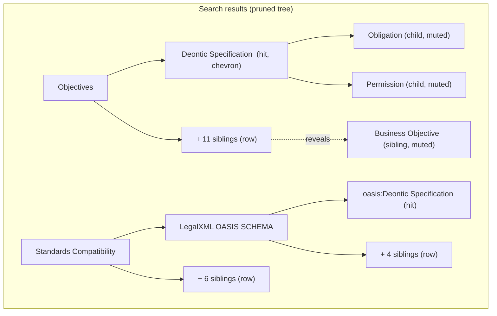

# Search Results Navigable Tree - Plan

## Goal Capsule

- **Objective:** A person who searches the FOLIO Ontology Explorer tree can keep browsing from any hit, down into its children and out to its siblings, without clearing the search or losing the other hits.
- **Product authority:** This plan. Decisions below were settled in dialogue with the repository owner on 2026-09-19; the visual probe that settled the sibling control is disposable and not authoritative.
- **Open blockers:** None. Every Outstanding Question is deferred to planning.

---

## Product Contract

### Summary

Search results on the explorer tree page become a tree you can navigate rather than a static list. A hit that has children gets a chevron and expands in place, loading children on demand. Each branch whose children the search pruned gets a "+N siblings" row that reveals them, styled as context rather than as hits. Search state, highlighting, and every other hit stay exactly where they were. Nouns (classes) and verbs (properties) behave identically.

### Problem Frame

Search on the explorer tree renders a pruned tree: only the matches and the ancestors above them. That is a calm view and it demos well, but it is a dead end. A match renders as a leaf even when it has dozens of children, and everything beside it on its branch is gone.

The moment of pain is a live demo. The presenter searches for a concept, the audience sees it in context, and the next question is always "what is under that?" or "what else sits next to it?". Today the only route is to clear the search and drill down the full tree by hand to the same node. That costs time, loses the place, drops the other matches off screen, and reads as friction to the people watching. The right-hand details panel does list Parents and Children, but clicking one of those links while a search is active half-rebuilds the branch with unfiltered nodes while the "N matches" header stays up, which is worse than leaving search mode cleanly.

Parents are not part of the gap. The pruned tree already shows the full ancestor chain above every hit, and the owner confirmed that covers the "parents" need.

### Key Decisions

- **Ancestor chain stands in for a parents control** (session-settled: user-directed — chosen over a "show parent" action or a details-panel-first approach: the pruned tree already renders every hit under its full ancestor path). No governed R; this decision removes a requirement rather than adding one.
- **Children expand in place on the hit, loaded lazily** (session-settled: user-approved — chosen over reading children in the details panel or clearing the search to drill the full tree: keeps the presenter's place and the other hits on screen). Governs R1, R2, R3.
- **Siblings reveal through a "+N siblings" row at the end of each pruned branch** (session-settled: user-directed — chosen over a "1 of 12" pill on the ancestor row and over a siblings button on the hit itself: the count is visible before clicking, and the row also covers siblings of ancestors, which a hit-level control cannot). Governs R4, R5, R6.
- **Revealed nodes look like context, not hits.** Children and siblings brought in after the search are visually muted and never highlighted, so the hits keep the eye. Governs R7.
- **The details panel's Parent and Children links honour search mode.** Following one of those links while a search is active selects the node inside the pruned tree, revealing its branch the same way the tree controls would, instead of rebuilding the branch from the full tree. Governs R9.
- **Verbs get the same behaviour as nouns.** Both trees share one search experience; this is a coverage requirement, not a second feature. Governs R10.

### Requirements

**Expanding a hit's children**

- R1. A search hit that has children in the full ontology shows an expand chevron, even when none of those children matched the search.
- R2. Activating that chevron loads the hit's children on demand and shows them beneath the hit, inside the search results, without reloading or clearing the search.
- R3. A revealed child that itself has children gets the same chevron, so a presenter can keep drilling from a hit as deep as the ontology goes.

**Revealing pruned siblings**

- R4. Every branch in the search results whose children were pruned ends with a row reading "+N siblings", where N is the number of children the search hid on that branch.
- R5. Activating the row reveals those hidden siblings in place, loaded on demand, with the row changing to a control that hides them again.
- R6. The row appears at every ancestor level that had pruned children, not only under a hit's direct parent, so a presenter can also answer "what else sits under this top-level branch".

**Keeping search context intact**

- R7. Children and siblings revealed after a search render as muted context: no match highlighting, no query highlighting, and clearly secondary to the hits, while remaining selectable.
- R8. Expanding children or revealing siblings never changes the match count, the highlighted hits, the visibility of the other hits, or the page URL.
- R9. Following a Parent or Child link in the details panel while a search is active selects that node inside the search results, revealing its branch as R2 or R5 would, and never rebuilds a branch from the full tree while search mode is on.
- R10. Every behaviour in R1 through R9 applies equally to the nouns (classes) tree and the verbs (properties) tree.
- R11. Selecting any revealed node updates the details panel and the URL exactly as selecting a node in the full tree does today.
- R12. Running a new search, clearing the search, or pressing Escape discards every revealed child and sibling and returns to the pruned results for the new query or to the full tree.

**Existing controls and keyboard**

- R13. The Expand and Collapse controls above the tree operate on revealed children the same way they operate on the full tree; Expand during a search may drill into hit children, which is desired.
- R14. Keyboard navigation reaches the new affordances: arrow keys expand and collapse a hit's children as they do in the full tree, and the "+N siblings" row is focusable and activates with Enter or Space.

The diagram shows one branch after the presenter expanded the first hit and revealed its siblings. Rows marked "+N siblings" sit at the end of each pruned branch, including the top-level branch under Standards Compatibility.

### Key Flows

- F1. Drill into a hit during a demo
  - **Trigger:** A search is active and a hit has children in the full ontology.
  - **Steps:** The presenter clicks the hit's chevron. Its children load and appear beneath it, muted. The presenter clicks a child's chevron and drills further. The match count and the other hits do not move.
  - **Outcome:** The audience sees the hit's subtree without the presenter leaving the search.
  - **Covered by:** R1, R2, R3, R7, R8.

- F2. Show what else sits next to a hit
  - **Trigger:** A search is active and a branch has pruned children.
  - **Steps:** The presenter clicks the "+N siblings" row at the end of the branch. The hidden siblings load and appear in place, muted, and the row becomes a hide control. Clicking it again collapses them.
  - **Outcome:** The hit is seen among its peers; the hits stay highlighted.
  - **Covered by:** R4, R5, R6, R7, R8.

- F3. Navigate from the details panel while searching
  - **Trigger:** A search is active, a hit is selected, and the presenter clicks a Child or Parent link in the details panel.
  - **Steps:** The tree reveals the target's branch inside the search results, selects the target, and updates the details panel and URL.
  - **Outcome:** The presenter stays inside the search results with the hits intact.
  - **Covered by:** R9, R11.

- F4. Leave search mode
  - **Trigger:** The presenter clears the search, presses Escape, or searches again.
  - **Steps:** All revealed children and siblings are discarded. The tree shows the new pruned results or the full tree.
  - **Outcome:** No stale revealed rows carry over between searches.
  - **Covered by:** R12.

### Acceptance Examples

- AE1. **Covers R1, R2.** Given a search for "deontic" where Deontic Specification has three children none of which match, when the presenter clicks its chevron, then Obligation, Permission, and Prohibition appear beneath it, muted, and the header still reads "3 matches".
- AE2. **Covers R1.** Given a hit with no children in the full ontology, when the results render, then it shows a leaf marker and no chevron.
- AE3. **Covers R4, R6.** Given Objectives has twelve children and one of them is a hit, when the results render, then the branch ends with "+11 siblings"; and given Standards Compatibility has seven children of which only LegalXML OASIS SCHEMA leads to a hit, then that branch ends with "+6 siblings".
- AE4. **Covers R4.** Given a branch where every child is a hit, when the results render, then no "+N siblings" row appears on that branch.
- AE5. **Covers R5, R7, R8.** Given "+11 siblings" is activated, when the siblings appear, then they are muted, none is highlighted, the hit stays highlighted, the URL is unchanged, and the row now offers to hide them.
- AE6. **Covers R9.** Given a search is active and the details panel shows Children for the selected hit, when the presenter clicks a child link, then that child appears under the hit inside the search results and becomes selected, and the "N matches" header remains accurate.
- AE7. **Covers R11.** Given a revealed sibling is clicked, when selection completes, then the details panel shows that sibling and the URL carries its node parameter, as it would from the full tree.
- AE8. **Covers R12.** Given siblings and children have been revealed, when the presenter runs a new search, then none of the revealed rows remain.
- AE9. **Covers R10.** Given a search for "deontic" returns the property oasis:deonticRule, when it has children or pruned siblings, then the verbs tree shows the same chevron and "+N siblings" behaviour as the nouns tree.
- AE10. **Covers R14.** Given a hit is selected via keyboard, when the presenter presses the right arrow, then the hit's children load and appear; and given focus is on a "+N siblings" row, when the presenter presses Enter, then the siblings are revealed.

### Success Criteria

- From an active search, a presenter reaches any hit's children and any hit's siblings in one click each, with no search clearing and no manual drill-down.
- The pruned results view is unchanged for anyone who never touches the new affordances: same rows, same highlighting, same first-match selection.
- Existing deep links (a URL carrying a node parameter) behave as they do today.

### Scope Boundaries

- No change to what search matches, how it ranks, or which fields it searches.
- No change to the details panel's layout or content, beyond making its Parent and Child links respect search mode (R9).
- No change to the Entity Graph tab; it continues to react to node selection as it does today.
- No pagination or virtualisation of very large branches in this plan; see Outstanding Questions.
- No mobile-specific redesign of the tree.

### Dependencies / Assumptions

- The full-tree child endpoints and the node endpoints already exist for both classes and properties and return enough to lazy-load children and count siblings; planning decides whether the search response should carry child and sibling counts directly or whether the page fetches them.
- No automated tests currently cover tree search or the tree page's JavaScript; planning should expect to add the first ones rather than extend existing ones.

### Outstanding Questions

**Deferred to Planning**

- Whether the search response carries "has children" and "hidden sibling count" per node, or the page derives them from existing endpoints. The requirement is only that the chevron and the "+N" count are correct.
- Whether a "+N siblings" row with very large N (some top-level FOLIO branches have hundreds of children) reveals all at once or in chunks. Default if undecided: reveal all in one activation, since the row already states N.
- Whether revealed rows persist when the presenter collapses and re-expands their parent within the same search, or are re-fetched. Either is acceptable; R12 governs only search changes.

### Sources / Research

- Tree page script: `folio_api/static/js/unified_tree.js` (search rendering, lazy child loading, keyboard navigation, details-panel selection path).
- Search and tree endpoints: `folio_api/routes/taxonomy.py`, `folio_api/routes/properties.py`.
- Page and details-panel markup: `folio_api/templates/jinja2/explore/tree.html`, `folio_api/templates/jinja2/components/class_details.html`, `folio_api/templates/jinja2/components/property_details.html`.
- Graph coupling to node selection: `folio_api/static/js/entity_graph.js`.
- Prior search plan that introduced match-field annotation: `docs/plans/2026-03-15-001-fix-search-missing-preflabel-matching-plan.md`.
- Explorer persona ("Marcus, knowledge engineer") in `README.md`.
